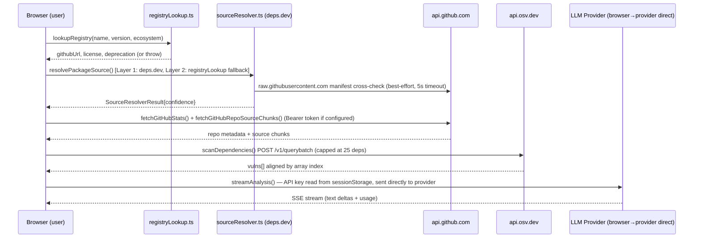
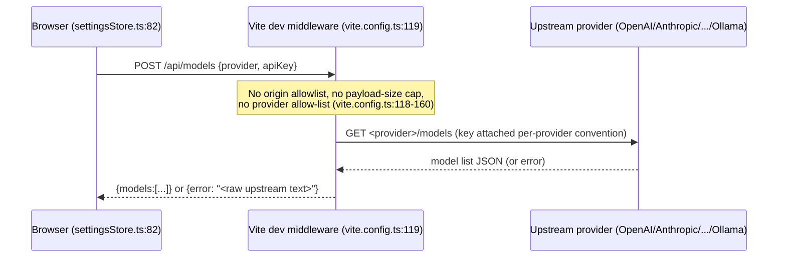

# API Contract Audit — TrustGuard AI

Scope: `/home/web-h-056/trustguard` (branch `batch-upload-working`). Reverse-engineered from
route handlers, provider clients, validators, and settings stores — not from the docs.

## Executive Summary

TrustGuard AI is a **client-only Vite/React SPA** (`package.json` — no `express`/`fastify`/
server framework dependency). It has **exactly one first-party inbound HTTP endpoint**,
`POST /api/models`, implemented as Vite dev-server middleware (`vite.config.ts:118-160`) with
no equivalent in the committed source for production (production relies on a *separate,
undeployed* Node service whose code only exists as a copy-paste block inside
`development-updates-and-notes/DEPLOYMENT.md`). Beyond that one endpoint, the application's
real "API contract surface" is **13 outbound third-party integrations** (GitHub, npm, PyPI,
crates.io, OSV, unpkg, deps.dev, raw.githubusercontent.com, and 9 LLM provider APIs) that the
browser calls directly with user-supplied credentials.

Total endpoints: **1 inbound** (`POST /api/models`, dev-only) + **13 outbound integration
surfaces** documented in the Inventory below.

Top 3 inconsistencies:
1. **Shipped dev proxy is materially weaker than its documented production replacement** — no
   origin allowlist, no payload-size cap, no provider-type check in `vite.config.ts:118-160`,
   vs. all three present in the `DEPLOYMENT.md` reference server (lines 255-300). The code
   actually in the repo is the permissive version, and it is configured to be reachable from
   the public internet (`server.allowedHosts` in `vite.config.ts:63` whitelists an ngrok
   hostname while `Access-Control-Allow-Origin: '*'` is set at `vite.config.ts:121`).
2. **Inconsistent secret-transmission channel across LLM providers** — 8 of 9 providers send
   the API key in an `Authorization`/`x-api-key` header (`src/lib/llm/providers/openai.ts:9`,
   `anthropic.ts:12`, `mistral.ts:9`, `groq.ts:9`, `together.ts:9`, `zai.ts:9`,
   `zhipu.ts` JWT-in-header); Gemini instead puts the raw key in the **URL query string**
   (`src/lib/llm/providers/gemini.ts` baseUrl + `src/lib/llm/LLMClient.ts:41-42`,
   also duplicated in `vite.config.ts:98` for the dev proxy) — query-string keys leak into
   browser history, proxy/CDN access logs, and `Referer` headers.
3. **Inconsistent error-handling contract across outbound fetchers** — `registryLookup.ts`
   (`lookupNpm`/`lookupPypi`/`lookupCratesIo`/etc.) `throw` on any non-OK response, while
   `npm.ts`, `github.ts`, `osv.ts`, `unpkg.ts`, `pypiStats.ts` all swallow failures and return
   `null`/`[]`. Callers in `orchestrator.ts` and `sourceResolver.ts` must know, per-fetcher,
   which convention applies.

Top 3 weak-validation findings:
1. `POST /api/models` (`vite.config.ts:118-160`) performs **no validation** on `provider`
   (any string is passed straight into `fetchModelsFromProvider`, `vite.config.ts:24`) and no
   payload-size limit — both are present in the documented "hardened" production version but
   absent from the code that actually ships in this repo.
2. The `ollama` branch of `fetchModelsFromProvider` (`vite.config.ts:88-91`) hard-codes a
   fetch to `http://localhost:11434/api/tags` on the machine running the Vite server. Combined
   with wildcard CORS and the public `allowedHosts` entry, any external origin can use
   `POST /api/models {"provider":"ollama"}` to probe/disclose whether an internal Ollama
   service is reachable from that host — a narrow, single-target SSRF primitive.
3. `registryLookup.ts:244` — `console.log("REGISTRY_BASES response", endpoint, data, info)`
   logs the **entire raw PyPI registry JSON response** to the browser console on every PyPI
   lookup; leftover debug statement, not gated behind a dev flag.

## Endpoint Inventory

### Inbound (first-party)

| Method | Path | Handler | Auth | Request schema | Response schema |
|---|---|---|---|---|---|
| POST | `/api/models` | `vite.config.ts:119-158` (`modelsProxyPlugin` → `middleware`) | `auth: NONE — verify intentional` (no auth of any kind; open to any origin per `Access-Control-Allow-Origin: '*'` at `vite.config.ts:121`) | Ad-hoc `JSON.parse(body)` at `vite.config.ts:141`, destructured `{ provider, apiKey }` — no schema/type validation on either field | `{ models: string[] }` on 200, `{ error: string }` on 400/405/500 — shape asserted by hand at `vite.config.ts:145-155`, no serializer |
| OPTIONS | `/api/models` | `vite.config.ts:124-127` | none | n/a | 200, empty body |

This is the **only** server-side route in the repository. It exists solely inside Vite's dev
middleware pipeline (`configureServer`/`configurePreviewServer`, `vite.config.ts:163-171`) and
is not present in a production static build (`vite build` emits static assets only —
`package.json:6`). `development-updates-and-notes/DEPLOYMENT.md` describes a **separate**,
hardened Node/Express-style reimplementation meant to run in production, but that
reimplementation is prose/code-block documentation only — it is not a file in this repository
and was not evaluated as "shipped" code.

### Outbound (third-party integrations called directly from the browser)

| Provider | Base URL | Caller | Auth carried | Request shape | Response parsing |
|---|---|---|---|---|---|
| GitHub REST | `https://api.github.com` | `src/lib/fetchers/github.ts:24-28`, `githubSource.ts` (multiple) | Optional `Authorization: Bearer <githubToken>` from `useSettingsStore` (`github.ts:16-19`); unauthenticated if no token set | GET, query/path params only | Hand-parsed JSON per field (no schema/type validator) |
| npm registry | `https://registry.npmjs.org`, `https://api.npmjs.org` | `src/lib/fetchers/npm.ts:16-20` | none | GET | Hand-parsed JSON |
| PyPI | `https://pypi.org/pypi/...`, `https://pypistats.org/api/...` | `registryLookup.ts:228`, `pypiStats.ts:25-28` | none | GET | Hand-parsed JSON |
| crates.io | `https://crates.io/api/v1/crates/` | `registryLookup.ts:308-311` | `User-Agent: TrustGuard/1.0` (crates.io policy requires an identifying UA) | GET | Hand-parsed JSON |
| pub.dev | `https://pub.dev/api/packages/` | `registryLookup.ts:342-343` | none | GET | Hand-parsed JSON |
| RubyGems | `https://rubygems.org/api/v1/gems/` | `registryLookup.ts:360-361` | none | GET | Hand-parsed JSON |
| NuGet | `https://api.nuget.org/v3/registration5/` | `registryLookup.ts:376-379` | none | GET | Hand-parsed JSON (nested `items[].items[].catalogEntry`) |
| Hex.pm | `https://hex.pm/api/packages/` | `registryLookup.ts:402-403` | none | GET | Hand-parsed JSON |
| Packagist | `https://packagist.org/packages/` | `registryLookup.ts:420-421` | none | GET | Hand-parsed JSON |
| Maven Central | `https://search.maven.org/solrsearch/select`, `https://repo1.maven.org/maven2/` | `registryLookup.ts:470-474`, `:490-494` | none | GET + regex-scraped `.pom` XML | Hand-parsed JSON / regex on POM text |
| deps.dev | `https://api.deps.dev/v3alpha/systems/...` | `sourceResolver.ts:94-97` | none | GET, `AbortSignal.timeout(8000)` | Hand-parsed JSON |
| raw.githubusercontent.com | manifest cross-check | `sourceResolver.ts:164, 232` | none | GET, `AbortSignal.timeout(5000)` | Plain text |
| OSV | `https://api.osv.dev/v1/query`, `/v1/querybatch` | `osv.ts:17-21`, `:93-97` | none | POST JSON `{package:{name,ecosystem}, version?}` | Hand-parsed JSON, `vulns[]` mapped to `Vulnerability` |
| unpkg | `https://unpkg.com/<pkg>@<version>/...` | `unpkg.ts:6, 49` | none | GET | Raw file text |
| LLM providers (9) | see `src/lib/llm/providers/*.ts` | `LLMClient.ts:45-49` | Per-provider: `Authorization: Bearer <key>` (OpenAI/Mistral/Groq/Together/Zai/Ollama-local-none), `x-api-key` (Anthropic), signed JWT in `Authorization` (Zhipu, built client-side in `zhipu.ts:20-49` using Web Crypto), **API key in URL query string** (Gemini) | POST, SSE-style streaming body (`buildBody`) | Provider-specific streaming parser (`parseStreamChunk`/`parseUsageFromChunk`) — no schema validator, hand-checked `?.` chains |

All outbound calls carry user-controlled input (`packageName`, `version`, GitHub `owner/repo`)
interpolated into URLs; every call site uses `encodeURIComponent` on the user-controlled
segment (verified in `npm.ts:17-19`, `registryLookup.ts` per-lookup functions, `unpkg.ts:6,49`,
`githubSource.ts:247,256,310` etc.) — no raw string concatenation of unescaped user input into
a URL was found.

## Per-endpoint examples

### `POST /api/models` (dev proxy)

Request:
```json
{ "provider": "anthropic", "apiKey": "sk-ant-..." }
```
Response (200):
```json
{ "models": ["claude-opus-4-7", "claude-sonnet-4-6", "..."] }
```
Response (500, e.g. bad key):
```json
{ "error": "HTTP 401: {\"type\":\"error\",...}" }
```
(`vite.config.ts:145-155` — the upstream provider's raw error text is passed through verbatim
to the browser, including whatever the upstream API returned.)

### OSV batch query

Request (`osv.ts:93-97`):
```json
{ "queries": [ { "package": { "name": "lodash", "ecosystem": "npm" }, "version": "4.17.15" } ] }
```
Response is mapped per-index back onto the input array (`osv.ts:105-130`); a missing/misaligned
`data.results[i]` is treated as "no vulnerabilities" rather than an error — a false-negative
risk if OSV's response array is ever shorter than the query array for reasons other than "no
vulns" (no assertion that `data.results.length === capped.length`).

## Non-trivial flows

### Flow 1 — package analysis: registry lookup → source resolution → GitHub fetch → LLM streaming



Note: the LLM call in this flow goes **directly from the browser to the third-party LLM
provider** — TrustGuard's own backend (the one `/api/models` route) is never in this path for
the actual analysis call, only for the model-listing dropdown.

### Flow 2 — `/api/models` dev-proxy request



## Pagination / filter / rate-limit patterns

| Pattern | Endpoints | Notes |
|---|---|---|
| No pagination (single-shot GET) | All registry/GitHub-stats endpoints (npm, PyPI, crates.io, RubyGems, Hex, Packagist, deps.dev) | These are lookups by exact package name, not list endpoints |
| GitHub `Link` header pagination (read-only) | `github.ts:37-38` (contributor count derived from `rel="last"` page number) | Only consumer of GitHub's cursor/link pagination; not exposed to the rest of the app as a general pattern |
| `?per_page=` | `github.ts:25-28` (`contributors?per_page=1`, `commits?per_page=100`) | Fixed page sizes, not user-adjustable |
| Batch/array request (not pagination) | `osv.ts:93` `/v1/querybatch`, capped at 25 items (`osv.ts:81`) | Cap exists specifically "to avoid rate limiting" per inline comment |
| Client-side rate limiting (outbound) | `src/lib/llm/rateLimiter.ts` — global 1 req/sec queue wrapping all LLM calls in batch mode | Applies only to LLM calls; GitHub/OSV/registry calls have no client-side throttle, relying entirely on the upstream service's own limits |
| Server-side rate limiting (inbound) | **None** for `/api/models` in the shipped `vite.config.ts` middleware. `nginx.conf` in `DEPLOYMENT.md:504` (`limit_req zone=trustguard_api burst=10 nodelay`) applies only to the undeployed production reference config, not to anything runnable from this repo. |

## Undocumented Endpoints

`POST /api/models` **is** documented (`development-updates-and-notes/DEPLOYMENT.md:37-45,134`),
but the documentation describes the *production* replacement server, not the *dev* middleware
that is the actual code in this repository — so while the path is documented, the deployed
contract (open CORS, no origin check, no payload cap, no provider validation) is not. Treat
this as a **documentation/code mismatch** rather than a fully undocumented endpoint (see
Inconsistencies).

None of the 13 outbound third-party integrations are documented as a formal contract (no
OpenAPI/SDL); they are described narratively in
`development-updates-and-notes/current-implementation.md:80-95` (ecosystem → registry mapping
table) which is reasonably accurate but does not enumerate auth headers, timeouts, or
error-handling conventions per integration.

## Inconsistencies

1. **Dev vs. documented-production hardening gap on `/api/models`** — see Executive Summary
   #1. Cites: `vite.config.ts:118-160` (shipped, permissive) vs.
   `development-updates-and-notes/DEPLOYMENT.md:245-304` (documented, hardened: origin
   allowlist at `DEPLOYMENT.md:255-260`, 4KB body cap at `DEPLOYMENT.md:277-281`, provider
   type check at `DEPLOYMENT.md:286-289`).
2. **Secret-transmission channel** — query-string API key for Gemini
   (`src/lib/llm/providers/gemini.ts` + `LLMClient.ts:41-42`, also `vite.config.ts:98`) vs.
   header-based `Authorization`/`x-api-key` for the other 8 providers
   (`openai.ts:9`, `anthropic.ts:12`, `mistral.ts:9`, `groq.ts:9`, `together.ts:9`,
   `zai.ts:9`, `zhipu.ts:63-66`, `ollama.ts` — no key).
2b. Anthropic additionally sets `anthropic-dangerous-direct-browser-access: true`
   (`anthropic.ts:13`) to bypass Anthropic's own CORS protection against browser-side key
   exposure — the only provider client that has to explicitly opt out of a vendor safety
   control to run from a browser context, another form of auth-handling inconsistency across
   the provider set.
3. **Error-handling contract** — `throw`-on-failure (`registryLookup.ts` lookup functions,
   all of which throw `Error` on non-OK responses, e.g. `registryLookup.ts:178-179`,
   `:232-241`, `:312-313`) vs. `return null`/`[]`-on-failure (`npm.ts:22`, `github.ts:31`,
   `osv.ts:23,46-47,99`, `unpkg.ts:7`, `pypiStats.ts:30,41-43`). Callers must special-case each
   fetcher's convention; `orchestrator.ts` wraps registry calls in `try/catch` specifically
   because they throw, while calls to `npm.ts`/`github.ts` are null-checked instead.
4. **Response-body error shape from `/api/models`** — passes upstream provider error text
   through verbatim inside `{error: "<upstream text>"}` (`vite.config.ts:97,`
   `fetchModelsFromProvider` catch blocks re-`throw`), so the shape of `error` varies per
   provider (JSON string, plain text, or an HTTP status line) depending on which upstream
   failed — the client (`settingsStore.ts:88-95`) attempts `JSON.parse(errorText)` and falls
   back to the raw string, i.e. the frontend itself has to guess the error envelope shape.

## Weak Validation Findings

1. `vite.config.ts:141-151` — `/api/models` handler does `JSON.parse(body)` then destructures
   `{ provider, apiKey }` with **no type/shape validation**: `provider` is only checked for
   truthiness (`if (!provider)`, `vite.config.ts:143`), not that it's a string or a member of
   the known provider set; `apiKey` has no check at all. Contrast with the documented
   production version which validates `typeof provider !== 'string'`
   (`DEPLOYMENT.md:286-289`).
2. `vite.config.ts:88-91` — the `ollama` branch performs an unconditional fetch to a
   hard-coded internal address (`http://localhost:11434/api/tags`) reachable by any caller of
   `/api/models` regardless of origin (CORS is `*`) — see Executive Summary weak-validation
   finding #2 (narrow SSRF-shaped disclosure).
3. `registryLookup.ts:244` — full raw API response logged via `console.log`, a leftover debug
   statement (not parameter-injection, but an unvalidated-output/data-exposure smell — flags
   internal registry response structure and content in production browser consoles).
4. No mass-assignment risk was found: this is a client-only app with no ORM/database layer,
   so there is no server-side record to mass-assign into. `useSettingsStore`/`analysisStore`
   (Zustand) setters are all explicit named setters (`setGithubToken`, `setNvdKey`, etc. —
   `settingsStore.ts:57-61`), not a generic `Object.assign(state, req.body)` pattern.
5. `settingsStore.nvdKey` (`settingsStore.ts:20,43,58`) is stored in state and exposed via
   `setNvdKey`, but **no fetcher in the codebase reads or sends it** (grep across
   `src/lib/fetchers/*` found zero references). This is a dead/unused setting rather than a
   validation bug, but it means the "NVD API key" UI field currently does nothing — worth
   flagging since a user may believe configuring it enables NVD-backed vulnerability data.

## Out of scope

- The `ai-assisted-development-skill-framework/` subtree (a vendored skill-framework repo, not
  part of TrustGuard's own API surface).
- Static asset serving (`/assets/*`, SPA fallback to `index.html`) — no data contract beyond
  standard static file serving, covered structurally in `DEPLOYMENT.md` nginx config.
- The hypothetical production `models-proxy` Node service described in `DEPLOYMENT.md` — audited
  only as a documentation artifact for the code-vs-docs comparison above; it is not code
  present in this repository and was not independently verified for runtime behavior.
- `LLMKeyManager` (`src/lib/keyManager.ts`) storage mechanism (`sessionStorage`, plaintext) is
  noted for context (auth-requirement provenance) but its security posture (XSS-exfiltration
  risk of plaintext session-stored keys) is a security-audit concern, not an API-contract
  concern, and is left to `audit-security`.
