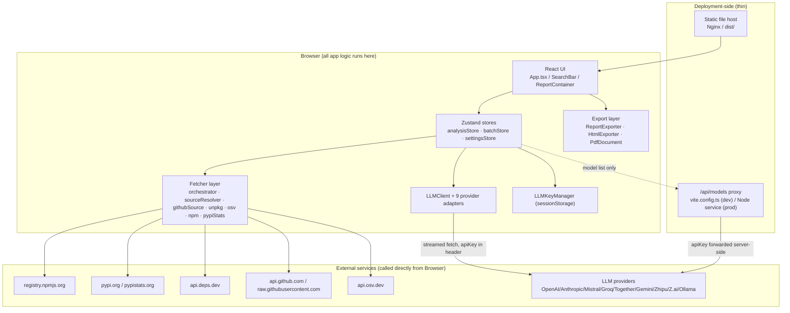
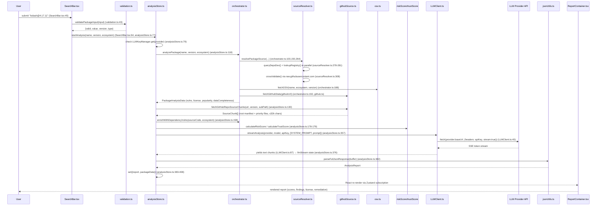

# Architecture Audit — TrustGuard AI

**Scope:** `/home/web-h-056/trustguard` (branch `batch-upload-working`)
**Method:** grep-seeded entry-point discovery + targeted reads (graphify unavailable — grep fallback per `docs/.cadence/.graphify-unavailable`). Every claim below cites `path:line`.

## Executive Summary

- TrustGuard AI is a **single-page React app with no application backend**. Every third-party call (npm/PyPI/OSV/GitHub/deps.dev/LLM providers) is made **directly from the browser** — confirmed by the app's own deployment doc (`development-updates-and-notes/DEPLOYMENT.md:29-38`) and by `LLMClient.streamAnalysis` fetching `provider.baseUrl` straight from client code (`src/lib/llm/LLMClient.ts:45-49`).
- The **only server-side component** is a `/api/models` proxy — a Vite dev middleware (`vite.config.ts:120-165`) mirrored by a standalone Node service in production (`development-updates-and-notes/DEPLOYMENT.md:33`) — used solely to list available models for a provider. It is the one place a user's LLM API key crosses a server boundary (`src/store/settingsStore.ts:82-86` posts `apiKey` in the request body); all inference calls bypass it entirely.
- LLM API keys and the optional GitHub token are kept in `sessionStorage` only (`src/lib/keyManager.ts:1-21`), never sent to any TrustGuard-controlled server for analysis — but they are held in a browser storage area reachable by any script that can execute in the page (XSS blast radius).
- There are two independently-maintained copies of the entire fetch→score→LLM pipeline — `src/store/analysisStore.ts:77-421` (single-package UI flow) and `src/lib/analysis/runFullAnalysis.ts:51-274` (batch flow) — with near-identical branching logic that has already drifted (only the batch path is rate-limited; see Risks).
- No routing library is actually wired up despite `react-router-dom` being a declared dependency (`package.json:20`) — the whole app is one `App.tsx` component switching on Zustand store state (`src/App.tsx:11-72`), not URL routes.

## Architecture Overview

Basis: `development-updates-and-notes/DEPLOYMENT.md:24-38` (topology diagram authored by the project itself, cross-checked against code), `src/lib/fetchers/orchestrator.ts:1-9` (fetcher imports), `src/lib/llm/LLMClient.ts:14-24` (provider registry).

## Request Lifecycle — "Analyze a single package" (SearchBar → rendered report)

Traced entry point: user submits a package name/URL in the search bar. This is the most-trafficked flow (batch mode calls the same fetch/score/LLM building blocks via a parallel implementation, see Risks).

Every hop terminates either at an external API boundary (GitHub/OSV/LLM provider) or at a React state write consumed by the UI — no server-side persistence exists in this flow.

## Entry Points

| Type | Name | path:line | Auth | Downstream |
|---|---|---|---|---|
| UI form submit | Search bar (package/GitHub URL) | `src/components/input/SearchBar.tsx:45` | None (client-only) | `analysisStore.startAnalysis` |
| UI file upload | Manifest file upload (package.json, requirements.txt, etc.) | `src/components/input/SearchBar.tsx:71` | None | `batchStore.startBatch` → parsers |
| UI batch trigger | "Run analysis" on selected dependencies | `src/components/batch/DependencySelector.tsx` → `src/store/batchStore.ts:76` | Requires LLM API key in sessionStorage (else metadata-only, `batchStore.ts:124-147`) | `runFullAnalysis` per item |
| Local HTTP proxy | `POST /api/models` | `vite.config.ts:120-165` | Provider apiKey forwarded in POST body | `fetchModelsFromProvider` → provider REST API (`vite.config.ts:21-113`) |
| CLI script | `scripts/run_analysis.ts` (standalone one-off analysis script, not part of the SPA) | `scripts/run_analysis.ts:1-54` | `MISTRAL_API_KEY` env var (`scripts/run_analysis.ts:25`) | Same `orchestrator`/`unpkg`/`githubSource` fetchers as the app |
| Outbound webhook-like call | GitHub tag/ref resolution and content fetch | `src/lib/fetchers/githubSource.ts:246,255,310` | Optional `githubToken` from settingsStore (`githubSource.ts:290`) | `api.github.com` |

No WebSocket handlers, queue consumers, schedulers, or cron jobs exist in this codebase — confirmed by an explicit grep for `setInterval`/`cron`/`Worker(` across `src/`, whose only hits are prompt-text describing what the LLM should *look for* in analyzed third-party code (`src/lib/llm/prompts.ts:41`, `src/lib/export/HtmlExporter.ts:671`), not actual scheduling in this app.

## Service Interactions

TrustGuard has no internal service-to-service edges — it is a single deployable unit (static SPA + one thin proxy). External edges, all initiated client-side unless noted:

- `orchestrator.ts:101-104` → `fetchNPMRegistry` + `resolvePackageSource` (parallel, `Promise.allSettled`) → npm registry.
- `orchestrator.ts:149-152` → `resolvePackageSource` + `fetchPyPIStats` (parallel) for PyPI-family ecosystems.
- `sourceResolver.ts:278-281` → `api.deps.dev` and `lookupRegistry` (registry-specific) in parallel, then `crossValidate` (`sourceResolver.ts:308`) hits `raw.githubusercontent.com` as a third, sequential call.
- `orchestrator.ts:187-195` → `fetchOSV` and `fetchGitHubStats` in parallel.
- `analysisStore.ts:130` / `runFullAnalysis.ts:90` → `fetchGitHubRepoSourceChunks` → multiple sequential+parallel `api.github.com` calls (ref resolution, root contents, `.github/workflows`, per-workspace directory contents) — up to `MAX_CHUNKS=5` chunks (`githubSource.ts:16`).
- `analysisStore.ts:357` / `runFullAnalysis.ts:222` → `LLMClient.streamAnalysis` → one of 9 provider adapters (`src/lib/llm/LLMClient.ts:14-23`) — direct browser→provider HTTPS call.
- `settingsStore.ts:82-96` → local `/api/models` proxy → provider's `/models` REST endpoint (server-side hop, the only one in the system).

Deployment topology is derived from `development-updates-and-notes/DEPLOYMENT.md` (Nginx serves `dist/` statically; `/api/models` is `proxy_pass`'d to a local Node process on a configurable port) — there is no `docker-compose.yml`, `k8s/`, or `terraform/` in this repo, so no containerized/orchestrated topology exists to diagram beyond this.

## Frontend Analysis

**Component hierarchy** (root `src/main.tsx:8` → `src/App.tsx`):
- `App.tsx:16-72` switches on `batchStore.status` and `analysisStore` fields (no router) between: `LandingPage` (`src/components/layout/LandingPage.tsx`) → `SearchBar`, `DependencySelector` (`src/components/batch/DependencySelector.tsx`), `BatchProgress` (`src/components/batch/BatchProgress.tsx`), an inline "needs API key" panel, and `ReportContainer` (`src/components/report/ReportContainer.tsx:52`).
- `ReportContainer.tsx:6-17` composes ~12 report panels (`ScoreGauge`, `VulnerabilityTable`, `ThreatModel`, `LicensePanel`, `RepoMetadataPanel`, `CodeReviewPanel`, `SecurityFindingsPanel`, `ExecutiveSummaryPanel`, `AlternativesPanel`, `RemediationPanel`, `TokenUsagePanel`, `RiskBadge`) — each a presentational component driven by props, not its own data fetching.

**State management**: three Zustand stores, no React Context, no server-state library (no react-query/SWR):
- `useAnalysisStore` (`src/store/analysisStore.ts:54`) — single-package analysis lifecycle, streaming LLM buffer, progress phases.
- `useBatchStore` (`src/store/batchStore.ts:46`) — multi-item batch lifecycle with its own retry state machine.
- `useSettingsStore` (`src/store/settingsStore.ts:39`) — LLM provider/model/keys, GitHub token, timezone; persists nothing to disk itself (keys delegate to `sessionStorage` via `LLMKeyManager`, `keyManager.ts:4-9`).

**Routing strategy**: none. `react-router-dom` (`package.json:20`) and `@types/react-router-dom` (`package.json:37`) are declared dependencies but no `BrowserRouter`, `useNavigate`, or route component appears anywhere under `src/` (verified by grep) — dead dependency, not a routed SPA.

**Data fetching**: all fetches happen inside the `lib/fetchers/*` and `lib/llm/*` modules invoked from Zustand store actions (`analysisStore.startAnalysis`, `runFullAnalysis`), not from components directly — components only read store state.

## Backend Analysis

There is no application backend service to analyze in the conventional sense. The sole server-side artifact:

- **Models proxy** (`vite.config.ts:115-168`): a Vite middleware in dev, replaced 1:1 by a standalone Node/pm2 service in production per `development-updates-and-notes/DEPLOYMENT.md` section 4. It receives `{provider, apiKey}` over POST, calls the provider's `/models` listing endpoint server-side (`vite.config.ts:21-113`), and returns model IDs. It sets `Access-Control-Allow-Origin: '*'` (`vite.config.ts:124`) and has no rate limiting, auth, or origin restriction of its own — see Risks.
- No workers, no queue topology, no scheduled jobs, no server-side cache, no search/index layer exist anywhere in this codebase.
- Client-side "rate limiting" of LLM calls is implemented as an in-memory single-flight queue (`src/lib/llm/rateLimiter.ts:13-84`), enforcing 1 request/second globally within one browser tab only — it has no cross-tab or cross-user effect since there is no server to hold shared state.

## Identified Risks (IS)

1. **Duplicated pipeline logic, already diverging** — `src/store/analysisStore.ts:77-421` (used by the single-package UI flow) and `src/lib/analysis/runFullAnalysis.ts:51-274` (used by batch) reimplement the same fetch→score→LLM sequence independently. The batch version wraps every LLM call in `globalLLMRateLimiter.scheduleRequest` (`runFullAnalysis.ts:161-163,185-187,222-223`); the single-package version calls `LLMClient.streamAnalysis` directly with no rate limiting (`analysisStore.ts:223-229,280-288,357-360`). Why it matters: any future bug fix or provider-quirk fix applied to one path silently does not apply to the other — this has already produced divergent rate-limit behavior between single and batch analysis.
2. **LLM API keys live in `sessionStorage`, reachable by any injected script** — `src/lib/keyManager.ts:4-9`. Combined with the fact that `SYSTEM_PROMPT`/analysis prompts embed LLM-fetched third-party source code and README content directly into the prompt sent back through the same browser context, any XSS in the rendering path (or a supply-chain-compromised dependency of this app itself) could read `sessionStorage` and exfiltrate provider keys. Why it matters: this is the highest-value secret in the client, stored with no additional isolation (e.g. no `HttpOnly`-equivalent protection is possible for `sessionStorage`).
3. **Open, unauthenticated models-proxy accepts arbitrary `apiKey`/`provider` and does a server-side fetch out to an attacker-influenced provider URL selection** — `vite.config.ts:120-168` combined with `fetchModelsFromProvider` (`vite.config.ts:21-113`). `Access-Control-Allow-Origin: '*'` (`vite.config.ts:124`) means any origin can POST a key through this proxy. The provider URL itself is hardcoded per `provider` string (not attacker-supplied), so this is not classic SSRF to arbitrary hosts, but it is an open relay that will forward any caller's third-party API key to the corresponding provider and echo back the response — usable to probe/verify the validity of a stolen key at no cost to the caller, and to launder request origin. Why it matters: it is deployed unauthenticated in production per `development-updates-and-notes/DEPLOYMENT.md` with no mention of auth/rate-limiting on this endpoint.
4. **Version-string based CVE cross-referencing is a pure client-side trust decision with no server-side verification** — `isAlreadyFixed(v.fixedInVersion, cleanVer)` in `src/lib/fetchers/orchestrator.ts:204-220` marks vulnerabilities `isApplicable: false` purely from string/semver comparison of registry-reported version numbers. Why it matters: this logic runs entirely in the browser and its correctness is un-auditable server-side; a malformed or spoofed `fixedInVersion` from a compromised OSV response would silently suppress a real finding in the UI (mentioned as a possible calibration issue in project memory notes — consistent with a broader "risk/trust score calibration" bug already tracked by the user).
5. **Debug `console.log` statements left in production batch logic** — `src/store/batchStore.ts:98` and `:187` (`console.log("looking_for_batch-1", ...)` / `"looking_for_batch-2"`). Why it matters: low severity, but signals the batch retry path was recently under active debugging (consistent with git log `"now the batch analysis is working but we're solving a few bugs"`) and these should not ship to production console output.
6. **Dead dependency `react-router-dom`** — declared in `package.json:20,37` but never imported anywhere under `src/` (verified by exhaustive grep). Why it matters: unused attack surface / bundle weight, and a maintenance-confusion risk since the app's actual "routing" is ad hoc `if/else` branching on Zustand store fields in `src/App.tsx:16-72`, easy for a new contributor to mistake for router-driven navigation.
7. **GitHub source-fetch file selection is heuristic and can silently under-sample security-relevant code** — `selectPriorityFiles` (`src/lib/fetchers/githubSource.ts:113-180`) caps at 8 files per chunk and `MAX_TOTAL_CHARS=32000` (`githubSource.ts:9-10`); any file beyond the size/count cap is truncated with `[TRUNCATED]`/`[ADDITIONAL FILES OMITTED...]` markers (`githubSource.ts:216,221`) with no signal surfaced to the trust/risk scoring layer that the review was partial. Why it matters: a package's real vulnerability could live in an omitted file, and the resulting "Secure Code Review" panel gives no visible confidence caveat tied to `dataCompleteness` for this specific omission.

No transaction-boundary or DB-locking risks apply — there is no database in this system (verified: no ORM, no ODM, no `docker-compose`/DB service, no ORM import found in any `src/lib` file during this audit).

## Recommendations (SHOULD)

- Consolidate `analysisStore.startAnalysis` and `runFullAnalysis` into one shared pipeline function parameterized by a status-callback, so single-package and batch flows cannot drift again (addresses Risk 1).
- Route single-package analysis LLM calls through `globalLLMRateLimiter` as well, for consistency and to avoid hitting provider rate limits outside batch mode.
- Add same-origin/CSRF-style checks or a shared-secret header to the `/api/models` proxy, and tighten CORS from `*` to the deployed app's own origin (addresses Risk 3).
- Surface `dataCompleteness`/truncation state explicitly in the Secure Code Review panel whenever `githubSource.ts` omits files, so users know the review was partial (addresses Risk 7).
- Remove the two leftover `console.log` debug lines in `batchStore.ts` and drop the unused `react-router-dom`/`@types/react-router-dom` dependencies.

## Out of Scope

- Deep review of the risk/trust scoring formulas (`src/lib/scoring/riskScore.ts`, `trustScore.ts`) — flagged only where it intersects request lifecycle; a scoring-calibration bug is already tracked separately in project memory (`score-calibration-bug.md`).
- Full audit of all 9 LLM provider adapters (`src/lib/llm/providers/*.ts`) — only `anthropic.ts` was read as a representative sample.
- API-contract-level documentation of the `/api/models` endpoint's request/response schema (belongs to `audit-api`).
- Database/schema review (there is no database in this system).
- Detailed OWASP-style vulnerability scoring of each risk above (belongs to `audit-security`).
