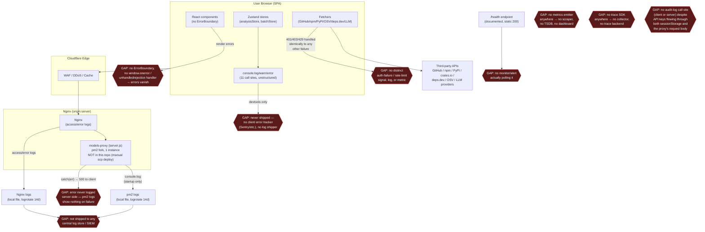

# Observability & Performance Audit — TrustGuard AI

Scope: `/home/web-h-056/trustguard` at commit `fe24b91` (branch `batch-upload-working`).
Method: grep-based inventory (graphify unavailable; kb fell back to grep) + targeted reads of every
fetcher, store, LLM client, and the documented production deployment (`development-updates-and-notes/DEPLOYMENT.md`).

**Architecture note that reframes this audit:** TrustGuard AI is a static client-side SPA (Vite +
React 19 + Zustand). Per `development-updates-and-notes/DEPLOYMENT.md` §1, *all* GitHub/npm/PyPI/OSV/LLM
calls are made directly from the user's browser; the only server-side component is a ~170-line
Node.js "models proxy" (`server.js`, documented but **not checked into this repo** — deployed via
manual `scp`, DEPLOYMENT.md:930-933) that relays `/api/models` calls behind Nginx/Cloudflare. There is
no database, no queue, no websocket server, and (in production) no dev-only Vite plugin. This changes
what "observability" and "bottleneck" mean here: most of the analysis pipeline runs in a single
browser tab, with the browser console as the only "log sink" and Zustand state as the only "trace."

## Executive Summary

**Top 3 observability gaps**
1. **Zero telemetry shipping, anywhere.** No metrics library, no trace SDK, no client error tracker
   (Sentry/etc.), no structured logging. Every `console.*` call (11 total, listed below) is the entire
   observability surface, and none of it leaves the user's browser tab or the proxy's local stdout.
2. **The one server-side component silently swallows every internal error.** `server.js`'s request
   handler catch-block returns the error message to the client but never logs it
   (`development-updates-and-notes/DEPLOYMENT.md:284-297`) — pm2 logs show nothing when an LLM
   provider integration breaks in production.
3. **No correlation ID / trace propagation across the analysis pipeline.** A single package scan
   fans out to 5-10 external APIs (registry, deps.dev, GitHub ×5, OSV, LLM) with no shared ID tying
   them together; `statusMessages` (the closest thing to a trace) live only in in-memory Zustand state
   and vanish on tab close/refresh.

**Top 3 bottleneck risks**
1. **GitHub API fan-out under batch concurrency.** `BATCH_SIZE = 5` concurrent packages
   (`src/store/batchStore.ts:38`), each triggering up to 5 parallel GitHub REST calls
   (`src/lib/fetchers/github.ts:23-29`) plus sequential per-manifest cross-validation fetches to
   `raw.githubusercontent.com` (`src/lib/fetchers/sourceResolver.ts:230-233`) — up to ~25+ concurrent
   GitHub-hosted requests per micro-batch, with 403/rate-limit responses silently treated as "no
   GitHub data" (`src/lib/fetchers/github.ts:31`).
2. **Sequential, non-concurrent retry loop.** `runAnalysis()` Phase B retries rate-limited batch items
   one at a time in a `for...of` loop with a fixed 15s sleep before each pass
   (`src/store/batchStore.ts:172-225`), instead of reusing Phase A's 5-way concurrency — retry time
   scales linearly with the number of rate-limited items.
3. **Unbounded per-status-update state cloning.** Every LLM stream token/status callback clones the
   entire batch `items` array (`src/store/batchStore.ts:108-111`), with no batch-size cap anywhere in
   the dependency-selection path — large manifests (e.g. a `package-lock.json` with hundreds of
   transitive deps) could drive O(n²) re-render churn.

---

## 1. Observability Inventory

### Logs (all unstructured; string interpolation, not key-value/JSON)

| Call site | Level | Notes |
|---|---|---|
| `src/store/batchStore.ts:98` | `console.log` | Debug leftover: `"looking_for_batch-1", item.version` |
| `src/store/batchStore.ts:187` | `console.log` | Debug leftover: `"looking_for_batch-2", item.version` |
| `src/lib/fetchers/registryLookup.ts:244` | `console.log` | Dumps the **full PyPI response body** (`endpoint, data, info`) to the browser console on every PyPI lookup — debug leftover, verbose, runs in production for every user |
| `src/store/analysisStore.ts:249` | `console.warn` | "no findings extracted" per chunk |
| `src/store/analysisStore.ts:342` | `console.error` | Synthesis JSON parse failure |
| `src/store/analysisStore.ts:411` | `console.error` | Final JSON parse failure |
| `src/store/settingsStore.ts:108` | `console.warn` | Live model-list fetch failed, falling back to static list |
| `src/lib/fetchers/unpkg.ts:60` | `console.error` | unpkg source fetch failure |
| `src/lib/fetchers/githubSource.ts:382` | `console.error` | GitHub sub-path source fetch failure |
| `src/lib/fetchers/githubSource.ts:513` | `console.error` | GitHub full-repo source fetch failure |
| `src/lib/fetchers/npm.ts:82` | `console.error` | npm registry fetch failure |
| `development-updates-and-notes/DEPLOYMENT.md:307` (`server.js`) | `console.log` | **Startup message only** — no per-request logging, no error logging in the request handler's catch block (`DEPLOYMENT.md:294-297`) |

None of these are structured (no JSON fields, no severity/level tagging beyond the console method, no
package/ecosystem/scan-id context attached consistently). All are dev-console-only; none are shipped
to a log aggregator.

### Metrics
**None found.** Grep across `src/` and `package.json` for Prometheus/StatsD/OpenTelemetry
meter/`prom-client`/web-vitals turned up zero hits. No counters, histograms, or gauges exist anywhere
in the codebase.

### Traces
**None found.** No OpenTelemetry (or any trace) SDK is imported. No trace/correlation headers are
attached to any of the ~10 external API integrations (`src/lib/fetchers/*.ts`) or to the
browser→models-proxy `/api/models` call (`vite.config.ts:117-170`, mirrored in `server.js`).

### Alerts
**None configured in-repo.** `development-updates-and-notes/DEPLOYMENT.md:884-894` documents adding an
Nginx `/health` endpoint "for uptime monitors," but no actual monitor/alert (UptimeRobot, Cloudflare
health check, PagerDuty, etc.) is configured or referenced anywhere — it's an instruction for future
infra work, not a live alert.

### Dashboards
**None found.** The only "dashboard" mentioned is `pm2 monit` (`DEPLOYMENT.md:901`), a local terminal
tool on the deploy box, not a persisted/shared dashboard. No Grafana/Datadog/CloudWatch dashboard
config exists in the repository.

### Audit logs
**None found.** `src/lib/keyManager.ts:5-19` stores LLM/GitHub API keys in `sessionStorage`; no audit
trail records when a key was set/used/cleared. The models-proxy (`server.js`) receives `provider` +
`apiKey` in every POST body (`DEPLOYMENT.md:273-300`) but logs nothing about who called it, when, or
with what outcome — there is no distinct audit-log call site anywhere in the stack, client or server.

---

## 2. Bottleneck Candidates

| # | Location | Reason |
|---|---|---|
| 1 | `src/store/batchStore.ts:88-165` (Phase A, `BATCH_SIZE=5`) | Each concurrent package independently fans out to registry + deps.dev + GitHub (5 parallel REST calls, `src/lib/fetchers/github.ts:23-29`) + OSV + source fetch — up to ~25+ simultaneous GitHub-hosted requests per 5-package micro-batch, against GitHub's per-token rate/secondary-rate limits, with no shared throttle (only LLM calls are rate-limited, per the module's own doc comment at `src/lib/llm/rateLimiter.ts:5-6`). |
| 2 | `src/lib/fetchers/sourceResolver.ts:230-251` (`crossValidate`) | `for` loop with `await` inside iterates manifest candidates **sequentially**, each fetching `raw.githubusercontent.com`; called once per package inside `resolvePackageSource` (line 308), multiplied by every concurrent batch item. |
| 3 | `src/store/batchStore.ts:172-225` (Phase B retry loop) | Rate-limited items are retried in a sequential `for...of` (line 179), not the 5-way concurrency used in Phase A, with a fixed `RETRY_DELAY_MS = 15_000` (line 39) sleep before every attempt — total retry wall-clock time is `items × 15s × up to 3 attempts` instead of `ceil(items/5) × 15s × 3`. |
| 4 | `src/lib/llm/rateLimiter.ts:1-79` (`globalLLMRateLimiter`, 1 req/sec) | By design (documented), but the `queueLength` getter (line 76-78) is never read anywhere in the codebase (confirmed via grep) — no UI/telemetry surfaces queue depth, so a large batch's true bottleneck (LLM serialization) is invisible to the user beyond generic status text. |
| 5 | `src/store/batchStore.ts:108-111` (`onStatus` callback) | Every LLM stream token/status line does `item.statusMessages = [...(item.statusMessages||[]), msg]` then `set({ items: [...items] })` — full array clone + Zustand notify per token, for every concurrently-running item, with no debounce/coalescing. |
| 6 | `src/lib/fetchers/githubSource.ts:454-507` (monorepo workspace fetch) | Up to `MAX_WORKSPACE_DIRS=4` (line 14) workspace dirs fetched concurrently, but each workspace then does 1-2 **sequential** follow-up fetches (package.json scripts, then `src/` subdir, lines 466-492) before file selection — multiplies GitHub REST calls per monorepo package on top of finding #1. |
| 7 | No caching layer anywhere (grep confirmed: no memoize/cache utility in `src/lib`) | `startBatch` only de-dupes by `${ecosystem}:${name}` (`src/store/batchStore.ts:51-52`); packages sharing a GitHub org/monorepo, or the same package at multiple versions, re-run the full registry/deps.dev/GitHub/crossValidate chain from scratch every time. |
| 8 | `server.js` (`DEPLOYMENT.md:306-312`) | `instances: 1`, `exec_mode: 'fork'` (ecosystem.config.js, `DEPLOYMENT.md:322-324`) — a single-threaded Node process serving all `/api/models` requests for the shared deployment, each doing a synchronous `https.request` with a 10s timeout (`DEPLOYMENT.md:169`) and no concurrency cap or queue-depth signal. |
| 9 | No cap on batch size found (grep of `DependencySelector.tsx`/`detector.ts` for `MAX`/`slice` limits returned nothing) | A manifest with hundreds of transitive dependencies (e.g. a large `package-lock.json`) could be selected in full for batch analysis, compounding findings #1, #5, and #7 at scale. |

---

## 3. Silent Failures

| Location | Pattern |
|---|---|
| `src/lib/fetchers/osv.ts:45-47` | `fetchOSV` — catch-all returns `[]`; a broken OSV integration is indistinguishable from "no vulnerabilities," directly and silently affecting risk scores. |
| `src/lib/fetchers/osv.ts:133-135` | `scanDependencies` — catch-all returns `[]`, no log. |
| `src/lib/fetchers/orchestrator.ts:328-330` | `enrichWithDependencyVulns` — catch-all returns `[]`, no log (wraps the already-silent `scanDependencies`, double-swallowed). |
| `src/lib/fetchers/github.ts:94-96` | `fetchGitHubStats` — catch-all returns `null`, no log; a GitHub outage or 403 rate-limit looks identical to "package has no GitHub repo" (see also line 31, which treats any non-OK response the same way). |
| `src/lib/fetchers/sourceResolver.ts:151-153` | `queryDepsDev` — catch-all returns `null`, no log. |
| `src/lib/fetchers/sourceResolver.ts:204-206` | `extractManifestName` — catch-all returns `null`, no log. |
| `src/lib/fetchers/sourceResolver.ts:280` | `.catch(() => null)` on `lookupRegistry(...)` inside `Promise.allSettled`, discarding thrown errors (e.g. "Version X not found in npm registry"). |
| `src/lib/analysis/runFullAnalysis.ts:110-121` | `try { enrichWithDependencyVulns(...) } catch { /* non-fatal */ }` — swallows again on top of the function's own internal catch. |
| `development-updates-and-notes/DEPLOYMENT.md:284-297` (`server.js` request handler) | Catch-all responds `500` with `err.message` to the client but never calls `console.error`/logs server-side — pm2/proxy logs show nothing when a provider integration breaks. |
| `src/lib/fetchers/registryLookup.ts:389-391`, `sourceResolver.ts` manifest parsing | `catch { /* ignore */ }` around best-effort parsing (Maven POM SCM extraction, PyPI publish-date parsing) — acceptable as best-effort, but zero visibility into how often these silently no-op. |
| React rendering / promise rejections app-wide | No `ErrorBoundary`/`componentDidCatch`, no `window.onerror`, no `unhandledrejection` listener anywhere in `src/` (grep confirmed zero matches) — any uncaught exception during report rendering or a batch run fails with no operator-visible signal at all beyond whatever the browser's own console shows that specific user. |

No circuit breakers exist in this codebase (none needed evaluation — architecture has no persistent
connections to break).

---

## 4. Weak Observability Findings

- **Metrics without alerts:** N/A in the traditional sense — there are no metrics to begin with. The
  finding *is* the absence (see Observability Inventory §Metrics).
- **Alerts without runbooks:** The documented `/health` endpoint (`DEPLOYMENT.md:884-894`) has no
  runbook and, more fundamentally, no alert is ever wired to it in this repo — it's an unconnected stub.
- **Unstructured logs:** All 11 `console.*` call sites listed in §1 use string interpolation, not
  key-value/JSON fields (e.g. `{package, ecosystem, phase, httpStatus}`) — none are parseable by a
  log pipeline if one were added.
- **Auth failures unlogged:** GitHub 401/403 and registry 401/403/429 responses are handled identically
  to any other non-OK response — `!response.ok` short-circuits to `null`/`[]`/generic
  `Error("... returned {status}")` (e.g. `src/lib/fetchers/github.ts:31`,
  `src/lib/fetchers/registryLookup.ts:178-179,232-241`) with no distinct log/metric for
  "credential rejected" vs. "service degraded" vs. "rate limited." Operators cannot tell whether a
  shared GitHub token has been revoked/exhausted or GitHub is simply down.
- **Missing trace propagation:** No correlation ID is generated per single-package or per-batch-item
  scan. `statusMessages` arrays (`src/store/analysisStore.ts`, `src/store/batchStore.ts`) are the
  closest analog to a trace but carry no ID, are never persisted, and disappear on tab close/refresh —
  there is no way to reconstruct "what happened during this specific scan" after the fact.

---

## 5. Telemetry Architecture Diagram (current state, gaps marked)

---

## 6. Prioritized Recommendations

| Priority | Recommendation | Metric / Alert (name, labels, target) | Rationale |
|---|---|---|---|
| P0 | Log every error inside `server.js`'s request handler catch block (`DEPLOYMENT.md:294-297`) before responding, e.g. `console.error(JSON.stringify({ts, provider, err: err.message}))`. | Metric: `models_proxy_errors_total{provider,status_code}` (counter). Alert: `ModelsProxyErrorRateHigh` — fire when `rate(models_proxy_errors_total[5m]) / rate(models_proxy_requests_total[5m]) > 0.2` for 5m. | Currently a broken/expired LLM provider integration in production is invisible — pm2 logs show nothing. |
| P0 | Remove the debug `console.log` leftovers at `src/store/batchStore.ts:98`, `src/store/batchStore.ts:187`, and `src/lib/fetchers/registryLookup.ts:244` (the latter dumps a full PyPI response body on every lookup). | N/A (cleanup) | Leftover debug logging ships to every production user's console; the PyPI one is verbose enough to be noise and a minor info-leak into a shared/screen-shared session. |
| P1 | Add a client-side error tracker (e.g. Sentry) wired through a top-level React `ErrorBoundary` plus `window.addEventListener('unhandledrejection', ...)` / `window.onerror`. | Metric: `client_uncaught_errors_total{component}` (via the tracker's own aggregation). Alert: `UncaughtClientErrorSpike` on error-count spike vs. 24h baseline. | Zero coverage today (grep confirmed) — any render crash or unhandled rejection during a scan is invisible to the team, and to the user beyond a frozen/blank UI. |
| P1 | Generate a correlation/scan ID (`crypto.randomUUID()`) per single-package and per-batch-item analysis; attach it to every `statusMessages` entry and every `console.*` call in `src/lib/fetchers/*.ts` and `src/lib/analysis/runFullAnalysis.ts`. | N/A (structural prerequisite for any future log aggregation) | Today there is no way to reconstruct "what happened during scan X" — `statusMessages` have no ID and live only in browser memory. |
| P1 | Distinguish 401/403/429 responses from generic failures in `src/lib/fetchers/github.ts:31`, `src/lib/fetchers/npm.ts`, `src/lib/fetchers/registryLookup.ts` — surface a distinct error/status instead of `null`/`[]`. | Metric: `external_api_rate_limited_total{api="github"\|"npm"\|"osv"\|"pypi"}`. Alert: `GithubTokenExhausted` when this counter rises while a token is configured. | Rate-limited batches currently degrade silently to "no GitHub data," corrupting `dataCompleteness`/risk scoring with no root-cause signal to user or operator (see Score Calibration Bug in session memory — this is a plausible contributing factor). |
| P2 | Parallelize the Phase B retry loop (`src/store/batchStore.ts:172-225`) using the same `BATCH_SIZE` concurrency as Phase A instead of a sequential `for...of`. | Metric: `batch_retry_duration_seconds` (histogram, label `attempt`). | Retry time currently scales linearly with rate-limited item count instead of `ceil(n/BATCH_SIZE)`. |
| P2 | Add an in-memory memoization cache (keyed by `ecosystem:packageName[:version]`) in front of `fetchGitHubStats`, `lookupRegistry`, and `queryDepsDev`, scoped to a single batch run. | Metric: `fetch_cache_hit_ratio{source="github"\|"registry"\|"deps_dev"}`. | Batches with shared GitHub orgs/monorepos or multi-version packages currently re-fetch identical data, compounding GitHub rate-limit exposure (Bottleneck #1/#7). |
| P2 | Debounce/coalesce the `onStatus` → `set({ items: [...items] })` calls in `src/store/batchStore.ts:108-111` (e.g. batch to one Zustand update per 200-250ms per item). | N/A (client perf) | Every LLM stream token currently clones the full batch-items array; scales poorly with large batches. |
| P2 | Bring `server.js` into this repository and its CI pipeline (`.github/workflows/ci.yml`) instead of manual `scp` deploys (`DEPLOYMENT.md:930-933`). | N/A (process) | The only server-side, security-relevant component (handles LLM API keys in POST bodies) currently has no code review trail, no automated deploy, and no git-based rollback. |
| P2 | Cap the number of dependencies selectable for a single batch run (no limit found in `DependencySelector.tsx`/`detector.ts`). | Metric: `batch_size_items` (gauge/histogram at batch start). | Large manifests (hundreds of transitive deps) compound bottlenecks #1, #5, and #7 with no current guardrail. |

---

## 7. Out of Scope

- **Database/schema review** — the application has no database (browser-only state via Zustand,
  `sessionStorage` for keys). N/A for `audit-schema`.
- **Queue/worker infrastructure** — no background job queue exists; "batch processing" is in-browser
  `Promise.all`/`for` loops, not a durable queue.
- **WebSocket scaling** — the app uses no websockets (LLM streaming uses `fetch` + `ReadableStream`,
  not a socket).
- **Third-party API SLA/reliability review** (GitHub, npm, PyPI, OSV, deps.dev, LLM providers) —
  treated as external dependencies outside this codebase's control; only the *handling* of their
  failures was audited here.
- **Security review of API-key handling** (`sessionStorage` storage, CORS/origin whitelist in
  `server.js`, whitelist enforcement in `registryLookup.ts`) — that is `audit-security` territory, not
  `audit-ops`; noted here only where it intersects with logging/observability (e.g. Finding: no audit
  trail for key usage).
- **Test coverage / CI verification depth** — `.github/workflows/ci.yml` runs lint, typecheck, and
  build but no test step (no `test` script exists in `package.json`); this is a `prove`/`build`
  concern, not observability, and is only mentioned here for context.
